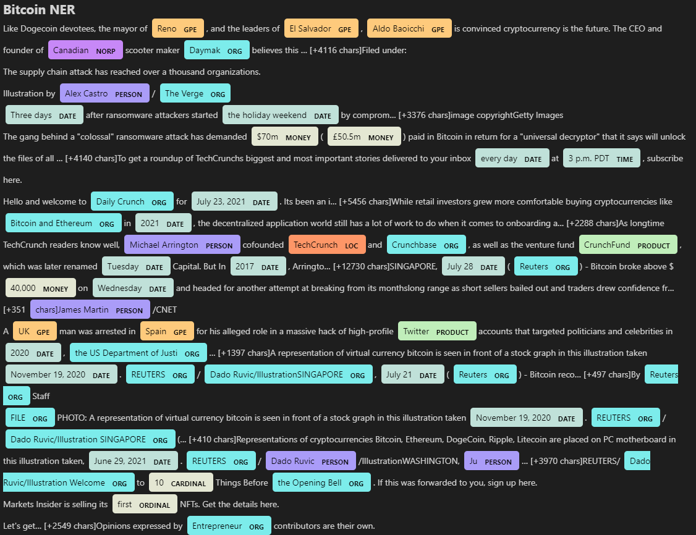
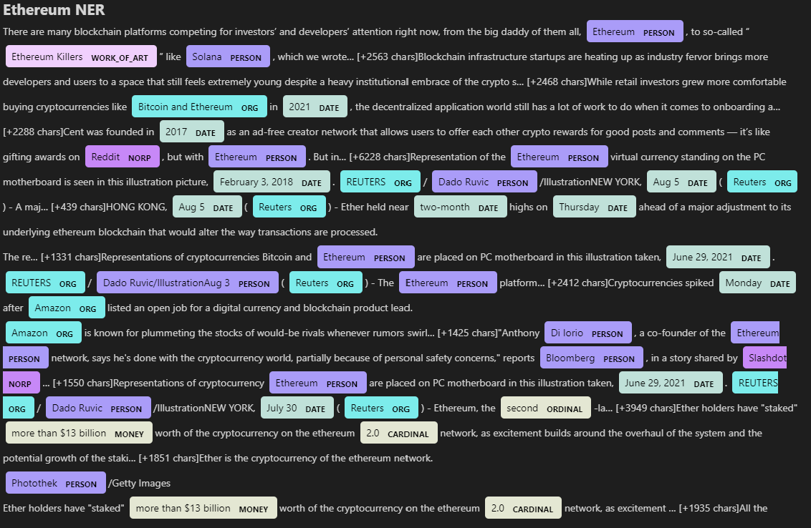

# Unit 12—Tales from the Crypto

## Background

There's been a lot of hype in the news lately about cryptocurrency, so you want to take stock, so to speak, of the latest news headlines regarding Bitcoin and Ethereum to get a better feel for the current public sentiment around each coin.

In this assignment, I will apply natural language processing to understand the sentiment in the latest news articles featuring Bitcoin and Ethereum. You will also apply fundamental NLP techniques to better understand the other factors involved with the coin prices such as common words and phrases and organizations and entities mentioned in the articles.

---

## Files

[Notebook](NLP/crypto_sentiments.ipynb)

---

# Key Learning Objectives 

## 1 - Sentiment Analysis

Use the [newsapi](https://newsapi.org/) to pull the latest news articles for Bitcoin and Ethereum and create a DataFrame of sentiment scores for each coin Bitcoin and Ethereum 

Use descriptive statistics to answer the following questions:

    a. Which coin had the highest mean positive score?

    b. Which coin had the highest negative score?

    c. Which coin had the highest positive score?

## 2 - Natural Language Processing

Use NLTK and Python to tokenize text, find n-gram counts, and create word clouds for both coins. 

### Tokenize

Initialized data and process the following workflow:

    a. Change each word to lowercases.

    b. Remove all punctuation.

    c. Remove the stop words.


### N-grams

Initialize ngrams and word frequency for each coin.

    a. Use NLTK to produce the ngrams for N = 2.

    b. List the top 10 words for each coin.


### Word Clouds

Generate word clouds for each coin to summarize the news for each coin.


## 3 - Named Entity Recognition

Build a named entity recognition model for both coins and visualize the tags using SpaCy.

--------

# Output 

# Sentiment Analysis

```

Q: Which coin had the highest mean positive score?

A: Based on headlines (titles), Bitcoin has the highest mean positive sentiment score (0.086 vs 0.051). On the other hand, the body text states that Ethereum has the higher mean positive score (0.064 vs 0.053).

Q: Which coin had the highest compound score?

A: Based on headlines, Bitcoin has the highest mean compound score (-0.042 vs -0.07). Howeverm  Ethereum has the highest mean compound score (0.143 vs 0.135) based on the body.

Q. Which coin had the highest positive score?

A: Based on both headlines Bitcoin(0.097) vs Ehtereum(0.075) and body Bitcoin(0.032) vs Ehtereum(0.021). Overall,  Ethereum has the highest mean negative score.

```

# Natural Language Processing 
----
## Bitcoin Word Cloud Output


----
## Ethereum Word Cloud Output


-----
# Named Entity Recognition 

-----
## Bitcoin Named Entity Output



-----
## Ethereum Named Entity Output

